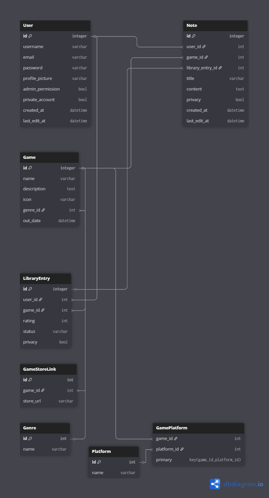

---

```markdown
# 🎮 GameLauncher – Gestionnaire de Jeux Personnel

> Un launcher de jeux de bureau en C# (.NET WinForms) avec authentification, bibliothèque personnalisée et suivi d’expérience joueur.

## 🚀 Objectif du projet

GameLauncher est une application bureau permettant à un utilisateur de :
- S'enregistrer / Se connecter
- Accéder à son profil joueur
- Gérer sa bibliothèque de jeux (jeux joués, en cours, à venir…)
- Noter, commenter et organiser ses jeux
- Accéder à des informations complémentaires sur chaque jeu
- Naviguer entre les différentes sections via une interface fluide

---

## 🏗️ Technologies utilisées

- **.NET** 9 (WinForms)
- **Entity Framework Core** (SQLite)
- **C#**
- **Git / GitHub**
- UI en WinForms avec logique MVC partielle

---

## 🔧 Fonctionnalités actuelles

- [x] Modélisation complète de la base de données (EF Core)
- [x] Création des classes C# des modèles : `User`, `Game`, `Note`, `Genre`, `LibraryEntry`, `GameStoreLink`, `Platform`, `GamePlatform`
- [x] Setup de `DbContext`, `DbContextFactory` et configuration SQLite
- [x] Fichier `appsettings.json` + migration initiale
- [x] Relations entre entités fonctionnelles et testées
- [x] Génération de la base `.db` avec `dotnet ef database update`
- [x] README à jour, `.gitignore` propre

---

## ⌛ Fonctionnalités à venir (prochaine étape)

🎨 **Phase UI / maquettage simple :**
- [ ] Création des formulaires de base sans logique backend :
  - LoginForm
  - RegisterForm
  - MainMenu / HomeView
  - GameLibraryView
  - GameDetailsView
- [ ] Navigation entre les écrans (boutons statiques)
- [ ] Premier aperçu visuel cohérent avec le projet
- [ ] Structure WinForms bien compartimentée (UserControl, etc.)

---

## 🗃️ Structure du projet


GameLauncher/
│
├── Models/              # Modèles EF Core (User, Game, Note…)
├── Views/               # WinForms (LoginForm, RegisterForm, MainMenu…)
├── Data/                # Database
├── Controllers/         # Logique métier (Register, Login, Navigation…)
├── Services/            # Services partagés (hash, navigation, session…)
├── Helpers/             # Utilitaires (validation, config…)
├── Assets/              # Images, icônes, fichiers statiques
├── appsettings.json     # Configuration EF / Connexion BDD
└── GameLauncher.sln     # Solution principale

```

## Schéma de la base de données



````
---

## ⚙️ Configuration requise

- .NET 9 SDK
- Visual Studio 2022+ (ou Rider)
- EF Core CLI :
  ```bash
  dotnet tool install --global dotnet-ef
````

---

## 🔄 Lancer l’application

1. Cloner le repo :

   ```bash
   git clone https://github.com/lerouxblond/GameLauncher.git
   cd GameLauncher
   ```

2. Installer les dépendances :

   ```
   dotnet restore
   ```

3. Créer la base de données :

   ```bash
   dotnet ef migrations add InitialCreate
   dotnet ef database update
   ```

4. Lancer l’application :

   ```bash
   dotnet run
   ```

---

## 📦 À venir

 UI fonctionnelle de connexion et inscription

 Connexion back–front via services

 Affichage des jeux de la DB

 Ajout/édition de notes utilisateurs

 Lancement d’un jeu via l’app

 Stats de jeu + paramètres utilisateur

---

## 🧠 Apprentissage

Projet réalisé dans un objectif de montée en compétences en :

* C# orienté objet
* Architecture MVC et services
* Manipulation d’Entity Framework
* Création d’une interface graphique utilisateur
* Gestion de projet et organisation Git

---

## 📄 Licence

Code open-source et libre d’usage pour un usage éducatif.

---

```